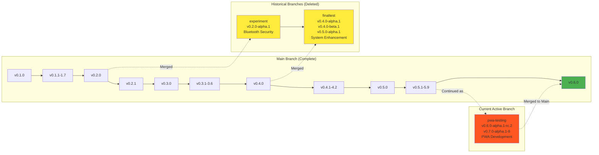

# GhostKey Branch Flow and Versioning Chart

## Complete Development Timeline (Including All Versions)

```mermaid
gitgraph
    commit id: "v0.1.0"
    commit id: "v0.1.1" tag: "PlatformIO Restructure" tagOrder: 1
    commit id: "v0.1.2" tag: "Start Sequence Fixes" tagOrder: 1
    commit id: "v0.1.3" tag: "Starter Pulse Config" tagOrder: 1
    commit id: "v0.1.4" tag: "GhostKey.ino Updates" tagOrder: 1
    commit id: "v0.1.5" tag: "Bluetooth Security" tagOrder: 1
    commit id: "v0.1.6" tag: "Code Organization" tagOrder: 1
    commit id: "v0.1.7" tag: "Name Updates" tagOrder: 1
    
    branch experiment
    checkout experiment
    commit id: "v0.2.0-alpha.1" tag: "Bluetooth Security Implementation" tagOrder: 1
    checkout main
    merge experiment tag: "Merged Bluetooth Features" tagOrder: 1
    
    commit id: "v0.2.0"
    commit id: "v0.2.1" tag: "Enhanced RFID Decoding" tagOrder: 1
    commit id: "v0.3.0"
    commit id: "v0.3.1" tag: "RFID Authentication" tagOrder: 1
    commit id: "v0.3.2" tag: "GPIO Pin Fixes" tagOrder: 1
    commit id: "v0.3.3" tag: "Config Interface" tagOrder: 1
    commit id: "v0.3.4" tag: "Typography Improvements" tagOrder: 1
    commit id: "v0.3.5" tag: "Bluetooth Toggle" tagOrder: 1
    commit id: "v0.3.6" tag: "Compilation Fixes" tagOrder: 1
    
    branch finaltest
    checkout finaltest
    commit id: "v0.4.0-alpha.1" tag: "System Enhancement" tagOrder: 1
    commit id: "v0.4.0-beta.1" tag: "Confidence Authentication" tagOrder: 1
    commit id: "v0.5.0-alpha.1" tag: "Mobile Analysis & Docs" tagOrder: 1
    checkout main
    merge finaltest tag: "v0.5.0 Release" tagOrder: 1
    
    commit id: "v0.5.1" tag: "Mobile Analysis" tagOrder: 1
    commit id: "v0.5.2" tag: "Mobile Layout Refactor" tagOrder: 1
    commit id: "v0.5.3" tag: "Navigation Pills Fix" tagOrder: 1
    commit id: "v0.5.4" tag: "Navigation Positioning" tagOrder: 1
    commit id: "v0.5.5" tag: "Fixed Position Approach" tagOrder: 1
    commit id: "v0.5.6" tag: "Scroll Navigation" tagOrder: 1
    commit id: "v0.5.7" tag: "Sticky Header" tagOrder: 1
    commit id: "v0.5.8" tag: "Config Tab Reorg" tagOrder: 1
    commit id: "v0.5.9" tag: "Mobile Layout Styling" tagOrder: 1
    
    branch pwa-testing
    checkout pwa-testing
    
    commit id: "v0.6.0-alpha.1" tag: "Mobile Layout Start" tagOrder: 1
    commit id: "v0.6.0-alpha.2"
    commit id: "v0.6.0-alpha.3"
    commit id: "v0.6.0-alpha.4"
    commit id: "v0.6.0-alpha.5"
    commit id: "v0.6.0-beta.1"
    commit id: "v0.6.0-beta.2"
    commit id: "v0.6.0-rc.1"
    commit id: "v0.6.0-rc.2" tag: "Mobile Complete" tagOrder: 1
    
    checkout main
    merge pwa-testing tag: "v0.6.0 Release" tagOrder: 1
    
    checkout pwa-testing
    commit id: "v0.7.0-alpha.1" tag: "PWA Start" tagOrder: 1
    commit id: "v0.7.0-alpha.2"
    commit id: "v0.7.0-alpha.3"
    commit id: "v0.7.0-alpha.4"
    commit id: "v0.7.0-alpha.5"
    commit id: "v0.7.0-alpha.6"
    commit id: "v0.7.0-alpha.7"
    commit id: "v0.7.0-alpha.8" tag: "Current PWA" tagOrder: 1
```

## Detailed Version Flow

```mermaid
flowchart TD
    A[v0.1.0<br/>Initial ESP32 System] --> B[v0.1.1<br/>PlatformIO Restructure]
    B --> C[v0.1.2<br/>Start Sequence Fixes]
    C --> D[v0.1.3<br/>Starter Pulse Config]
    D --> E[v0.1.4<br/>GhostKey.ino Updates]
    E --> F[v0.1.5<br/>Bluetooth Security]
    F --> G[v0.1.6<br/>Code Organization]
    G --> H[v0.1.7<br/>Name Updates]
    
    H --> I[v0.2.0-alpha.1<br/>Bluetooth Security Implementation]
    I --> J[v0.2.0<br/>Enhanced RFID Decoding]
    J --> K[v0.2.1<br/>Enhanced RFID Decoding]
    K --> L[v0.3.0<br/>RFID Authentication System]
    L --> M[v0.3.1<br/>RFID Authentication]
    M --> N[v0.3.2<br/>GPIO Pin Fixes]
    N --> O[v0.3.3<br/>Config Interface]
    O --> P[v0.3.4<br/>Typography Improvements]
    P --> Q[v0.3.5<br/>Bluetooth Toggle]
    Q --> R[v0.3.6<br/>Compilation Fixes]
    
    R --> S[v0.4.0-alpha.1<br/>System Enhancement]
    S --> T[v0.4.0-beta.1<br/>Confidence Authentication]
    T --> U[v0.4.0<br/>Bluetooth Confidence Auth]
    U --> V[v0.4.1<br/>System Enhancement]
    V --> W[v0.4.2<br/>Confidence Authentication]
    W --> X[v0.5.0-alpha.1<br/>Mobile Analysis & Docs]
    X --> Y[v0.5.0<br/>Mobile Analysis & Docs]
    
    Y --> Z[v0.5.1<br/>Mobile Analysis]
    Z --> AA[v0.5.2<br/>Mobile Layout Refactor]
    AA --> BB[v0.5.3<br/>Navigation Pills Fix]
    BB --> CC[v0.5.4<br/>Navigation Positioning]
    CC --> DD[v0.5.5<br/>Fixed Position Approach]
    DD --> EE[v0.5.6<br/>Scroll Navigation]
    EE --> FF[v0.5.7<br/>Sticky Header]
    FF --> GG[v0.5.8<br/>Config Tab Reorg]
    GG --> HH[v0.5.9<br/>Mobile Layout Styling]
    
    HH --> II[PWA Testing Branch]
    
    II --> JJ[v0.6.0-alpha.1<br/>Mobile Layout Refactor]
    JJ --> KK[v0.6.0-alpha.2<br/>Navigation Pills Fix]
    KK --> LL[v0.6.0-alpha.3<br/>Navigation Positioning]
    LL --> MM[v0.6.0-alpha.4<br/>Fixed Position Approach]
    MM --> NN[v0.6.0-alpha.5<br/>Scroll Navigation]
    NN --> OO[v0.6.0-beta.1<br/>Sticky Header]
    OO --> PP[v0.6.0-beta.2<br/>Config Tab Reorg]
    PP --> QQ[v0.6.0-rc.1<br/>Mobile Layout Styling]
    QQ --> RR[v0.6.0-rc.2<br/>Final Mobile Improvements]
    
    RR --> SS[v0.6.0<br/>Main Release]
    
    II --> TT[v0.7.0-alpha.1<br/>PWA Support]
    TT --> UU[v0.7.0-alpha.2<br/>iOS Safari Fixes]
    UU --> VV[v0.7.0-alpha.3<br/>Icon Content-Type Fix]
    VV --> WW[v0.7.0-alpha.4<br/>PNG Icon Endpoint]
    WW --> XX[v0.7.0-alpha.5<br/>Custom Ghost Icon]
    XX --> YY[v0.7.0-alpha.6<br/>Black Status Bar]
    YY --> ZZ[v0.7.0-alpha.7<br/>mDNS Support]
    ZZ --> AAA[v0.7.0-alpha.8<br/>Latest Changes]
    
    style A fill:#e1f5fe
    style SS fill:#c8e6c9
    style AAA fill:#fff3e0
    style I fill:#ffeb3b
    style S fill:#ffeb3b
    style X fill:#ffeb3b
```



## Complete Branch History Overview



## Version Categories

### Production Releases (Main Branch)
- **v0.1.0** - Initial development version
- **v0.1.1-1.7** - PlatformIO restructure, Bluetooth security, code organization
- **v0.2.0** - Enhanced RFID decoding
- **v0.2.1** - Enhanced RFID decoding improvements
- **v0.3.0** - RFID authentication system
- **v0.3.1-3.6** - RFID authentication, GPIO fixes, config interface, typography, Bluetooth toggle
- **v0.4.0** - Bluetooth confidence-based authentication
- **v0.4.1-4.2** - System enhancement, confidence authentication
- **v0.5.0** - Complete system with mobile optimization
- **v0.5.1-5.9** - Mobile analysis, layout refactor, navigation improvements
- **v0.6.0** - Mobile layout and navigation improvements

### Historical Development Branches (Deleted)
- **experiment** - v0.2.0-alpha.1: Bluetooth security implementation with pairing mode
- **finaltest** - v0.4.0-alpha.1, v0.4.0-beta.1, v0.5.0-alpha.1: System enhancement and mobile analysis

### Current Development Branch (PWA Testing)
#### Mobile Layout Phase (v0.6.0-x)
- **Alpha (1-5):** Core mobile layout development
- **Beta (1-2):** Navigation improvements and UI reorganization
- **RC (1-2):** Final mobile styling and testing

#### PWA Phase (v0.7.0-alpha-x)
- **Alpha (1-8):** Progressive Web App implementation and iOS compatibility

## Key Milestones

1. **v0.1.0** - Foundation established
2. **v0.1.5** - Bluetooth security implementation
3. **v0.2.0-alpha.1** - Experiment branch: Bluetooth security features
4. **v0.3.2** - Critical GPIO pin fixes
5. **v0.4.0-alpha.1** - Finaltest branch: System enhancement
6. **v0.4.0-beta.1** - Finaltest branch: Confidence authentication
7. **v0.5.0-alpha.1** - Finaltest branch: Mobile analysis
8. **v0.5.9** - Mobile layout complete
9. **v0.6.0** - Mobile-first design complete
10. **v0.7.0-alpha.1** - PWA functionality introduced
11. **v0.7.0-alpha.8** - Current development state

## Complete Versioning Summary

- **6 Major Releases** (v0.1.0 - v0.6.0)
- **18 Patch Versions** (v0.1.1 - v0.5.9)
- **3 Historical Branch Versions** (v0.2.0-alpha.1, v0.4.0-alpha.1, v0.4.0-beta.1, v0.5.0-alpha.1)
- **23 Current Branch Versions** (v0.6.0-alpha.1 - v0.7.0-alpha.8)
- **Total: 47 Version Tags** 