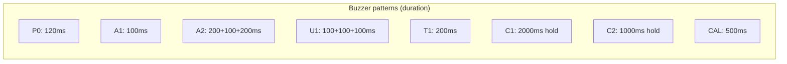
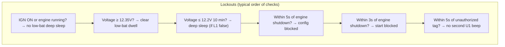
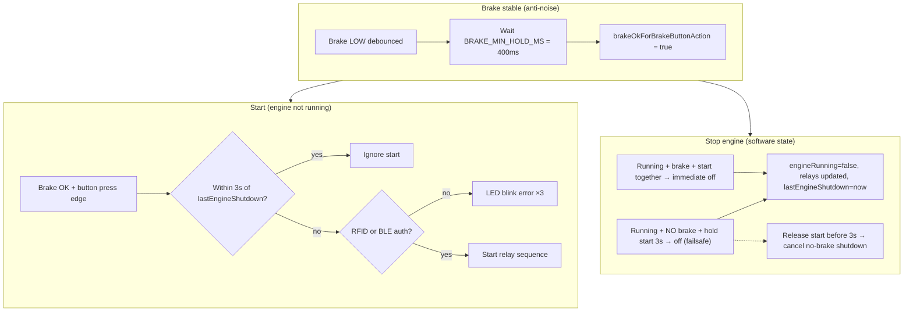
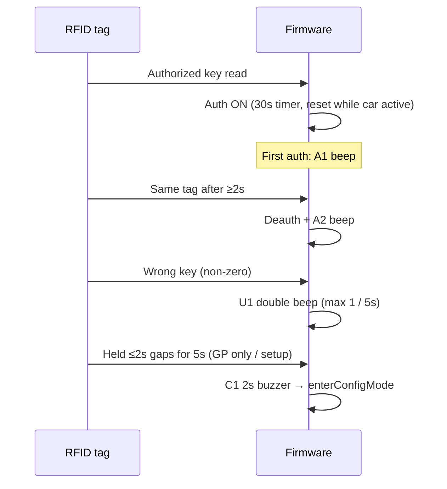
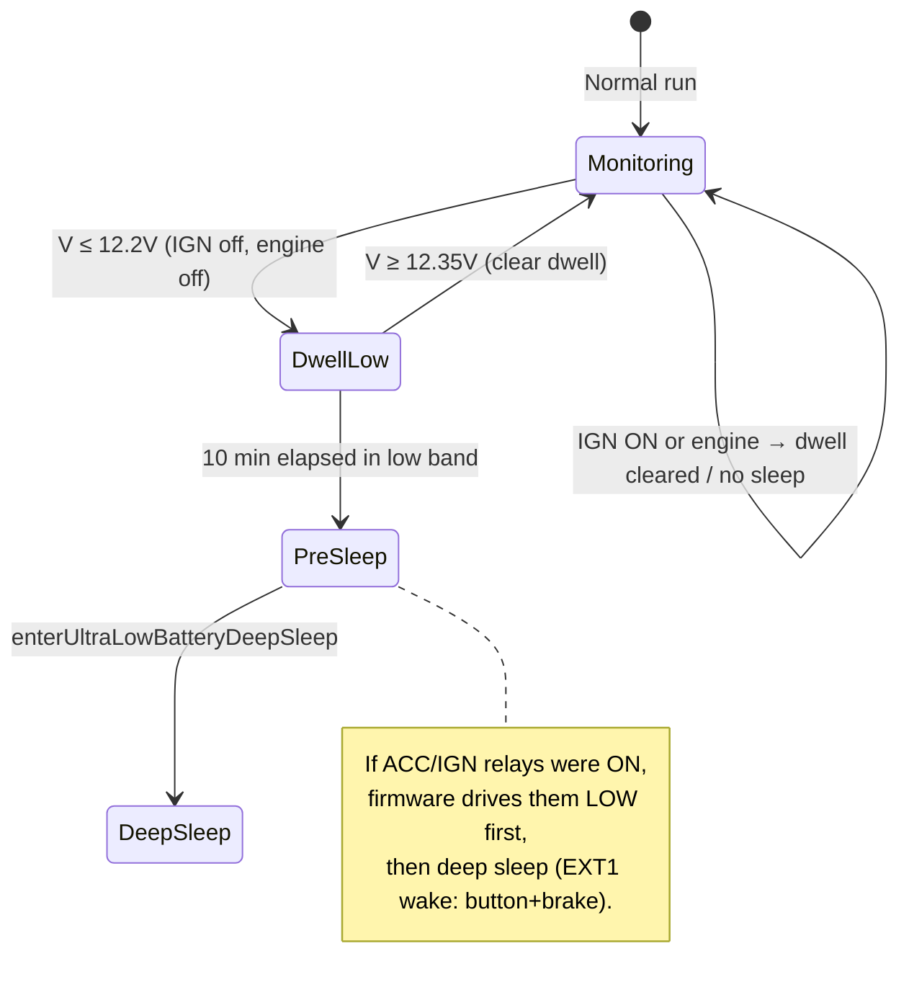

# GhostKey — Beeps, Lockouts, Holds & Sequences

Reference derived from `src/GhostKey.ino` (verify against `#define` values after edits).

---

## 1. Buzzer / beep catalog

| ID | Pattern | Total time (approx.) | When it fires | Config mode? |
|----|---------|----------------------|---------------|--------------|
| **P0** | 120 ms pulse | ~120 ms | Cold boot / reset only (`ESP_SLEEP_WAKEUP_UNDEFINED`); **not** on ESP deep-sleep wake | N/A |
| **A1** | 100 ms | ~100 ms | First RFID auth after boot (single “key accepted” chirp) | No |
| **A2** | 200 ms + 100 ms gap + 200 ms | ~500 ms | Same authorized tag scanned again after **≥ 2 s** → RFID deauth | No |
| **U1** | 100 ms + 100 ms gap + 100 ms | ~300 ms | Unauthorized tag (non‑zero bytes, fails key check); **once per 5 s** max | No |
| **T1** | 200 ms | ~200 ms | RFID auth **30 s timeout** while system **OFF** (accessory/ignition not active) | No |
| **C1** | Continuous **2 s** tone | 2000 ms | RFID **5 s hold** → enter config (Ghost Power only / setup incomplete paths) | N/A (entry) |
| **C2** | Continuous **1 s** tone | 1000 ms | RFID **5 s hold** → exit config (Ghost Power only) | N/A (exit) |
| **CAL** | 500 ms | ~500 ms | BLE calibration **completed** (web flow) | Via web |

---

## 2. Lockouts, cooldowns & “blocked” windows

| Name | Duration | What it blocks / means |
|------|----------|-------------------------|
| **Post‑engine‑shutdown config lockout** | **5 s** | `enterConfigMode()` (RFID long hold + start‑button long press paths) after GhostKey **software** engine stop |
| **Engine restart cooldown** | **3 s** | New **start sequence** after `lastEngineShutdown` (brake+button start only) |
| **Unauthorized RFID beep cooldown** | **5 s** | Repeat **U1** beep |
| **WiFi / button release guard** | **5 s** | Ignores some **button release** (cycle OFF→ACC→IGN) after WiFi ops |
| **Config mode: tap to exit** | **5 s** since last press | Start button in config must wait **> 5 s** since `lastButtonPress` to exit |
| **Web session** | **10 min** | `WEB_SESSION_TIMEOUT` |
| **Web inactivity** | **5 min** | `WEB_ACTIVITY_TIMEOUT` |
| **Low battery → deep sleep dwell** | **10 min** continuous low band | Voltage **≤ 12.2 V** (start dwell); cleared only **≥ 12.35 V**; **no sleep** if **IGN on** (`ACCESSORY_INPUT_PIN` LOW) or **engineRunning** |
| **Low battery wake grace** | **60 s** | After low‑bat deep sleep wake: full power; then sleep again if still bad and no IGN/engine |
| **Factory reset hold** | **30 s** | Start + brake held together (`FACTORY_RESET_TIME`) |

---

## 3. Start button + brake — normal driving sequence

**Inputs:** start button **active LOW**, brake **active LOW** when pressed. Debounce **50 ms** on both.

**Accessory / ignition stepping (no brake):** button **release** with brake **not** held cycles `systemState`: **OFF → ACC → IGN → OFF** (if authenticated), subject to WiFi **5 s** guard and not while shutting down / cranking / engine running.

---

## 4. Start button — config mode (long press)

| Mode | Brake | Hold time | Auth required | Result |
|------|-------|-----------|---------------|--------|
| **Ghost Key enabled** | **Not** held | **5 s** (`CONFIG_MODE_PRESS_TIME`) | RFID or (BLE + enabled + GK) | `enterConfigMode()` — **only when `!engineRunning`** |
| **Ghost Power only** (`!ghostKeyEnabled && ghostPower`) | **Not** held | **5 s** | RFID or BT auth (path in code) | `enterConfigMode()` |

Additional: **5 s** post‑shutdown **config lockout** (see §2). `enterConfigMode()` also requires auth.

**Exit config:** short press start in config if **`millis() - lastButtonPress > 5000`**.

---

## 5. RFID — auth, deauth, config holds

| Constant | Value | Role |
|----------|-------|------|
| `RFID_AUTH_TIMEOUT` | **30 s** | Auth expires when **system OFF** and not cranking / not in accessory+ / no engine |
| `RFID_DEAUTH_TIMEOUT` | **2 s** | Min time after auth before **same tag** scan counts as **deauth** (A2 beep) |
| `RFID_CONFIG_HOLD_TIME` | **5 s** | Continuous tag presence → config **enter** (eligible modes only) |
| `RFID_CONFIG_EXIT_HOLD_TIME` | **5 s** | Continuous tag → config **exit** (Ghost Power only, in config) |
| `RFID_CONTINUOUS_READ_TIMEOUT` | **2 s** | Max gap between reads; hold timers **reset** if tag “lost” longer than this |

---

## 6. Cranking / starter timing

| Item | Value |
|------|--------|
| Default starter pulse | `starterPulseTime` from NVS, default **`STARTER_PULSE_TIME` = 700 ms** |
| **Extended crank** | If still **button + brake + auth + startRelayActive** after initial pulse → crank continues until release |
| Relay pattern during crank | IGN1+START on; ACC/IGN2 off (see `controlRelays()`) |
| Engine running | ACC+IGN1+IGN2 on; START off |

---

## 7. Battery & deep sleep (summary)

---

## 8. Other notable timers (BLE / power)

| Name | Value | Notes |
|------|-------|-------|
| `LIGHT_SLEEP_DELAY_MS` | 20 s | After unauthenticated (power path messaging) |
| `BRAKE_WAKEUP_ACTIVE_TIME` | 30 s | Extended active after brake/button wake from light sleep |
| Brake wake stabilize | **2 s** | Before completing brake wake sequence |
| `BLE_DEEP_SLEEP_INTERVAL_MS` | 12 s | Deep sleep BLE cycle total |
| `BLE_DEEP_SLEEP_DURATION_MS` | 8 s | Advertising window in that cycle |
| `CONFIG_MODE_TIMEOUT` | 30 s | Config session timeout (if used in code paths) |
| `AUTO_LOCK_TIMEOUT` | 30 s | Security autolock timing (preferences) |
| `FACTORY_RESET_TIME` | 30 s | Start + brake factory reset |

---

## 9. How to keep this doc accurate

1. Search `src/GhostKey.ino` for `#define` blocks under **TIMING CONSTANTS**, **RFID**, **Battery**, **Brake/start failsafe**.
2. Search for `buzzerPulse`, `buzzerOn`, `enterConfigMode`, `enterUltraLowBatteryDeepSleep`.

---

*Generated as a human‑readable map of behavior; not a substitute for release notes or wiring diagrams.*
